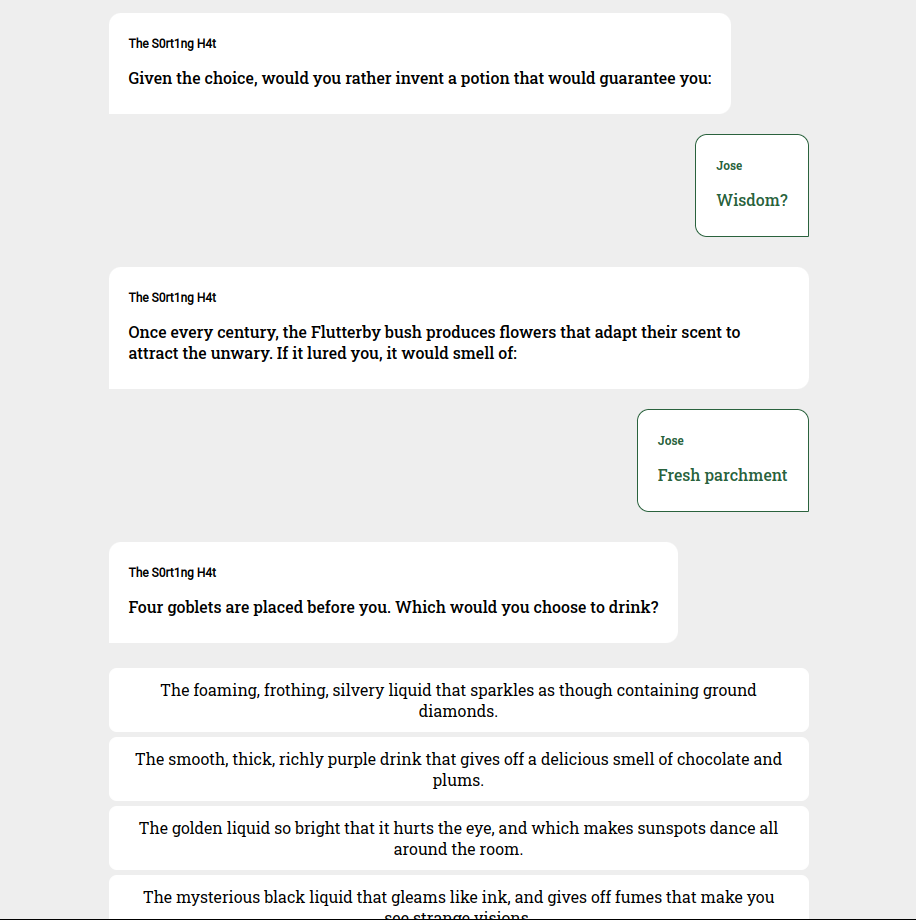

# Harry Potter | House Test #

A chat-like application with various questions that determine which Hogwarts house you belong to.

## Installation ##

- Clone this repository.

```bash
git clone https://github.com/JoseFerAlvarez/harry-potter-house-test.git
```

- Install npm packages.

```bash
npm i
```

- You can start the aplication in a local environment with the following script (localhost:3000).

```bash
npm run start
```

## How to contribute ##

1. Clone this repository and make a pull request to the develop branch.

```bash
git clone https://github.com/JoseFerAlvarez/harry-potter-house-test.git
```

2. Fork this repository and make a pull request from your repository.
[Follow this tutorial](https://docs.github.com/es/pull-requests/collaborating-with-pull-requests/proposing-changes-to-your-work-with-pull-requests/creating-a-pull-request-from-a-fork)

## Web view ##


